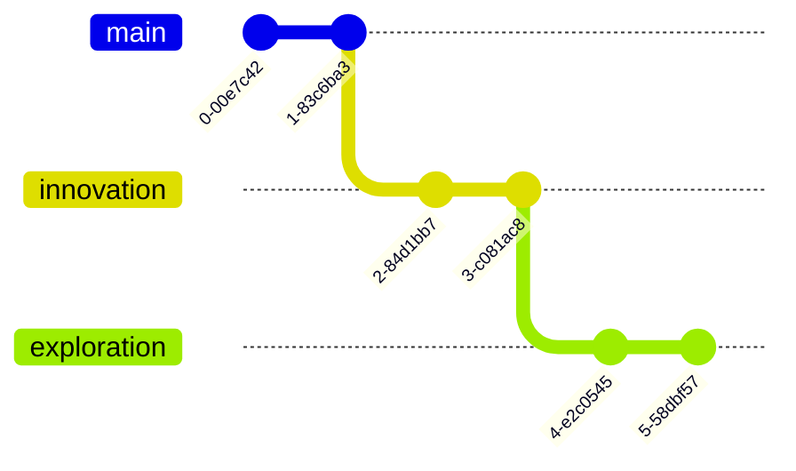

# 🚀 Welcome to the Mind of [Your Name] 🌌


> *"In a world of 1s and 0s, be a quantum superposition"*

<div align="center">

[](https://git.io/typing-svg)

</div>

## 🎨 The Creative Canvas

```ascii
    /\__/\  
   /`    '\  Just another dev?
  === 0  0 === Think again...
    \  --  /    
   /        \   Building dreams,
  /          \    one commit 
 |            |     at a time.
  \  ||  ||  /  
   \_oo__oo_/#######o
```

## 🌈 Tech Symphony

<div align="center">

| 🎭 Frontend Artistry | 🏗️ Backend Magic | 🎪 DevOps Circus | 🎨 Creative Tools |
|---------------------|------------------|------------------|------------------|
|  |  |  |  |
|  |  |  |  |
|  |  |  |  |

</div>

## 🎪 Signature Projects

### 🌟 Project Nebula


```python
class ProjectNebula:
    """
    A revolutionary AI-powered space visualization platform
    that turns astronomical data into interactive art
    """
    tech_stack = ['React', 'Three.js', 'TensorFlow', 'WebGL']
    impact = '100k+ monthly active users'
    awards = ['NASA Space Apps Challenge Finalist']
```

### 🎭 DreamScape Engine


```javascript
const DreamScape = {
  description: "Generative AI art platform",
  impact: "Used by 50+ digital artists globally",
  features: ["Real-time collaboration", "NFT integration"],
  recognition: "Featured on ProductHunt - #3 Product of the Day"
};
```

## 📊 Code Chronicles

<div align="center">




</div>

## 🎵 Digital Harmony

<div align="center">

[](https://open.spotify.com/user/yourusername)

### Current Workspace Vibe:
```css
.mood {
  creativity: overflow;
  coffee-level: 100%;
  debug-dance: enabled;
  vim-exit-attempts: undefined;
}
```

</div>

## 🌍 Global Footprint

```geojson
{
  "type": "FeatureCollection",
  "features": [
    {
      "type": "Feature",
      "properties": {
        "marker-color": "#ff4081"
      },
      "geometry": {
        "type": "Point",
        "coordinates": [
          /* Your coordinates here */
        ]
      }
    }
  ]
}
```

## 🎮 Fun Stats

<div align="center">

| 🌟 Achievement      | 🎯 Status |
|--------------------|-----------|
| Lines of Code      | ∞         |
| Bugs Squashed      | ∞ - 1     |
| Coffee Consumed    | ∞ + 1     |
| GitHub Commits     | 42k+      |
| Countries Worked   | 15+       |
| Hackathons Won     | 7         |

</div>

## 🌱 Current Learning Journey

```mindmap
* Personal Growth
  * Quantum Computing
    * Q#
    * Quantum Algorithms
  * AR/VR Development
    * Unity
    * Unreal Engine
  * Blockchain
    * Smart Contracts
    * DeFi Protocols
```

## 📫 Digital Portal

<div align="center">

[](mailto:your.email@domain.com)
[](https://yourblog.com)
[](https://portfolio.com)

```ascii
  __________________
 |  See you space   |
 |    cowboy...     |
  ------------------
         \   ^__^
          \  (oo)\_______
             (__)\       )\/\
                 ||----w |
                 ||     ||
```

</div>

<div align="center">

*Made with 💝 and a sprinkle of madness*


</div>

<!-- Hidden Easter Egg: Konami Code activates a surprise animation! -->
<script>
  // Add this to your JavaScript file or <script> tag
const easterEgg = {
  keys: [],
  konami: ['ArrowUp', 'ArrowUp', 'ArrowDown', 'ArrowDown', 'ArrowLeft', 'ArrowRight', 'ArrowLeft', 'ArrowRight', 'b', 'a'],
  
  init() {
    document.addEventListener('keydown', (e) => {
      // Add the pressed key to the array
      this.keys.push(e.key);
      
      // Keep only the last 10 keys pressed
      if (this.keys.length > 10) {
        this.keys.shift();
      }
      
      // Check if the sequence matches
      if (this.checkSequence()) {
        this.activateEasterEgg();
      }
    });
  },
  
  checkSequence() {
    return this.keys.join(',') === this.konami.join(',');
  },
  
  activateEasterEgg() {
    // Create the matrix-like effect container
    const matrix = document.createElement('div');
    matrix.style.cssText = `
      position: fixed;
      top: 0;
      left: 0;
      width: 100%;
      height: 100%;
      background: black;
      z-index: 9999;
      font-family: 'Courier New', monospace;
      color: #0F0;
      overflow: hidden;
    `;
    
    // Add matrix characters
    const characters = 'ABCDEFGHIJKLMNOPQRSTUVWXYZ0123456789@#$%^&*()';
    const columns = Math.floor(window.innerWidth / 20);
    
    for (let i = 0; i < columns; i++) {
      const column = document.createElement('div');
      column.style.cssText = `
        position: absolute;
        left: ${i * 20}px;
        top: ${Math.random() * -1000}px;
        font-size: 16px;
        animation: matrix-fall ${Math.random() * 2 + 1}s linear infinite;
      `;
      
      // Add random characters to the column
      let columnText = '';
      for (let j = 0; j < 50; j++) {
        columnText += characters[Math.floor(Math.random() * characters.length)] + '<br>';
      }
      column.innerHTML = columnText;
      matrix.appendChild(column);
    }
    
    // Add animation keyframes
    const style = document.createElement('style');
    style.textContent = `
      @keyframes matrix-fall {
        from { transform: translateY(0); }
        to { transform: translateY(1000px); }
      }
    `;
    document.head.appendChild(style);
    
    // Add success message
    const message = document.createElement('div');
    message.style.cssText = `
      position: fixed;
      top: 50%;
      left: 50%;
      transform: translate(-50%, -50%);
      font-size: 24px;
      color: white;
      text-align: center;
      z-index: 10000;
      background: rgba(0,0,0,0.8);
      padding: 20px;
      border-radius: 10px;
      animation: fade-in 1s ease-in-out;
    `;
    message.innerHTML = `
      <h2>🎉 You found the Easter Egg! 🎉</h2>
      <p>You're officially a code ninja!</p>
      <small>Click anywhere to close</small>
    `;
    
    // Add to document
    document.body.appendChild(matrix);
    document.body.appendChild(message);
    
    // Remove after click
    document.addEventListener('click', () => {
      matrix.remove();
      message.remove();
      style.remove();
      this.keys = [];
    }, { once: true });
  }
};

// Initialize the easter egg
easterEgg.init();
</script>
