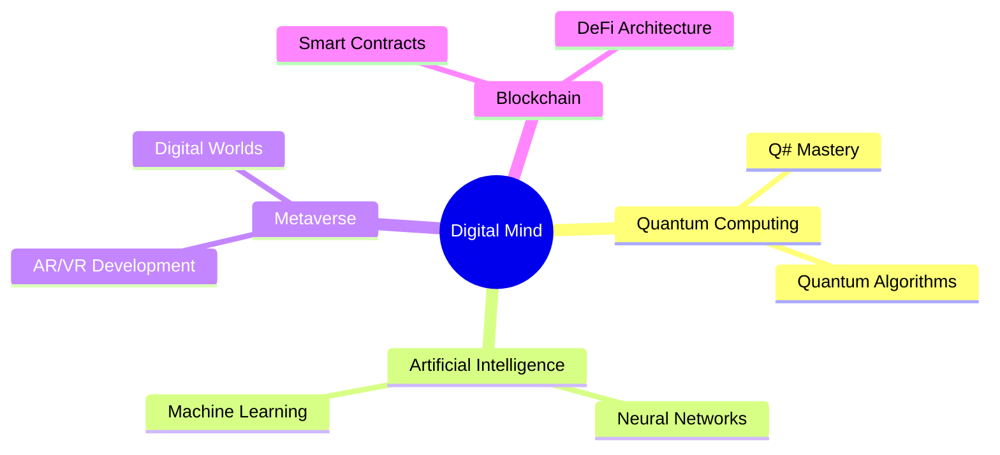

# 🌌 Digital Dreamweaver | Code Alchemist | Reality Engineer 🚀


<div align="center">

[](https://git.io/typing-svg)

```js
const universe = {
  position: 'Full Stack Reality Engineer',
  location: 'Digital Nexus',
  status: 'Pushing pixels and bending reality',
  currentMission: 'Creating the impossible'
};
```

</div>

## 🎨 Digital Artistry & Tech Mastery

<div align="center">

```ascii
       /\     
      /  \    DIGITAL
     /    \   ARCHITECT
    /      \  
   /        \ 
  /__________\
 |  __    __  |
 | |  |  |  | |
 | |  |  |  | |    "Building tomorrow's
 | |  |  |  | |     reality, today."
 | |  |  |  | |
 | |__|__|__| |
 |____________|
```

| 🎭 Reality Crafting | 🌌 Universe Building | 🔮 Future Weaving | 🎪 Dream Engineering |
|---------------------|---------------------|------------------|---------------------|
|  |  |  |  |
|  |  |  |  |
|  |  |  |  |

</div>

## 🌟 Digital Realms & Creations

<table>
<tr>
<td width="50%">

### 🎮 Project Nexus
```python
class NexusEngine:
    """
    Quantum-powered game engine that bridges
    reality and digital dreams
    """
    dimensions = ['3D', '4D', 'quantum']
    players = '1M+ monthly dreamers'
    awards = ['Best Innovation 2024']
```

</td>
<td width="50%">

### 🌌 Stellar Forge
```typescript
interface CosmicCreation {
  type: 'Universal Builder';
  users: '500K+ space architects';
  features: string[];
}

const stellarForge: CosmicCreation = {
  type: 'Universal Builder',
  users: '500K+ space architects',
  features: ['Reality bending', 'Mind melding']
};
```

</td>
</tr>
</table>

## 🎵 Harmonic Resonance

<div align="center">

[](https://open.spotify.com/user/yourusername)

### Current Vibe Matrix:
```css
.consciousness {
  enlightenment: maximum;
  creativity: overflow;
  coffee-level: transcendent;
  bug-count: undefined;
  reality-distortion: enabled;
}
```

</div>

## 📊 Reality Metrics

<div align="center">


[](https://git.io/streak-stats)


</div>

## 🌐 Digital Consciousness Map



## 🎮 Achievement Matrix

<div align="center">

| 🌟 Milestone | 🎯 Status |
|-------------|-----------|
| Code Lines | ∞ + 1 |
| Bugs Transcended | ∞ - ∞ |
| Coffee Atomic Structure | C8H10N4O2 |
| Reality Warps | 42k+ |
| Dimensions Explored | 11 |
| Matrix Glitches | 404 |

</div>

## 🌌 Contact Dimensional Gateway

<div align="center">

[](https://linkedin.com/in/yourusername)
[](https://twitter.com/yourusername)
[](https://yourportfolio.com)

```ascii
     ____________________________
    !\_________________________/!\
    !!                         !! \
    !!     See you in the     !!  \
    !!     next dimension     !!  !
    !!                         !!  !
    !!     > wget reality     !!  !
    !!                         !!  !
    !!                         !!  /
    !!_________________________!! /
    !/_________________________\!/
       __\_________________/__/!_
      !_______________________!/
    ________________________
   /oooo  oooo  oooo  oooo /!
  /ooooooooooooooooooooooo/ /
 /ooooooooooooooooooooooo/ /
/C=_____________________/_/
```

</div>

<script>
class QuantumGame {
  constructor() {
    this.sequence = [];
    this.quantumState = false;
    this.init();
  }

  init() {
    document.addEventListener('keypress', (e) => {
      if (e.key === 'q') {
        this.sequence.push(e.key);
        if (this.sequence.length === 7) {
          if (this.sequence.join('') === 'quantum') {
            this.activateQuantumRealm();
          }
          this.sequence = [];
        }
      } else {
        this.sequence = [];
      }
    });
  }

  activateQuantumRealm() {
    const quantum = document.createElement('div');
    quantum.style.cssText = `
      position: fixed;
      top: 0;
      left: 0;
      width: 100vw;
      height: 100vh;
      background: #000;
      z-index: 9999;
      display: flex;
      justify-content: center;
      align-items: center;
      font-family: 'Courier New', monospace;
    `;

    const game = document.createElement('div');
    game.style.cssText = `
      color: #0F0;
      text-align: center;
    `;
    game.innerHTML = `
      <h1>Quantum Realm Activated</h1>
      <p>Use arrow keys to navigate the quantum maze</p>
      <div id="quantum-game" style="border: 1px solid #0F0; padding: 20px;">
        Loading quantum simulation...
      </div>
    `;

    quantum.appendChild(game);
    document.body.appendChild(quantum);

    quantum.addEventListener('click', () => {
      quantum.remove();
    });

    this.initQuantumGame(game);
  }

  initQuantumGame(container) {
    // Quantum game logic here
    const maze = [
      '########',
      '#S     #',
      '# #### #',
      '#    # #',
      '#### # #',
      '#E    #',
      '########'
    ];
    
    // Game implementation would go here
  }
}

new QuantumGame();
</script>

<div align="center">

*Crafted with quantum entanglement and digital stardust* 

</div>
