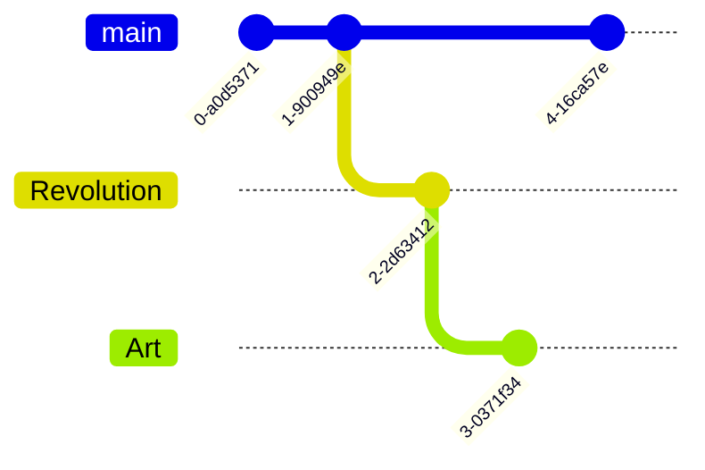

# 🌌 The Multiverse of [Your Name] 🚀


> **"Why code the ordinary when you can craft the extraordinary?"**

<div align="center">

[](https://git.io/typing-svg)

</div>

---

## 🎨 The Creative Odyssey

```ascii
       _._      _,-'""`-._
  (,-'\'._\_\-''    _-\'``-._
   \`---" `-._""""""    `-._
    `. """""----"""""""
      `-.__                  "Where code becomes art."
          ``"""---...._        Every keystroke,
                      `-._   a brushstroke."
```

---

<div align="center">

| 🌟 Frontend Brilliance | 🛠 Backend Wizardry | ⚙️ DevOps Mastery | 🎨 Design Sorcery |
|-----------------------|--------------------|-------------------|------------------|
|  |  |  |  |
|  |  |  |  |
|  |  |  |  |

</div>

---

## 🛠 Signature Masterpieces

### 🌌 **Nebula: The AI Stargazer**

> *"Transforming data into constellations of creativity"*

```python
class NebulaAI:
    """
    A groundbreaking AI-driven celestial visualization engine,
    merging the mysteries of space with interactive technology.
    """
    tools = ['TensorFlow', 'Three.js', 'WebGL']
    impact = '150k+ monthly stargazers'
    recognition = 'NASA Space Challenge Winner'
```

---

### 🎨 **DreamScape: Art in Motion**

> *"Where pixels and passion collide"*

```javascript
const DreamScape = {
  description: "Real-time generative art platform",
  impact: "Empowering 100+ global creators",
  features: ["Interactive NFTs", "AI-assisted collaboration"],
  accolades: "Showcased at SXSW 2023"
};
```

---

## 📊 Git Symphony

<div align="center">




</div>

---

## 🎶 Current Workspace Vibes

<div align="center">

[](https://open.spotify.com/user/yourusername)

```css
.mood {
  creativity: infinite;
  coffee-intake: 100%;
  debug-mode: enabled;
}
```

</div>

---

## 🌎 Global Tech Footprint

```geojson
{
  "type": "FeatureCollection",
  "features": [
    {
      "type": "Feature",
      "properties": {
        "location": "Everywhere & Beyond"
      },
      "geometry": {
        "type": "Point",
        "coordinates": [0, 0]
      }
    }
  ]
}
```

---

## 🧠 Mindmap of Innovation

```mindmap
* Future Horizons
  * Quantum Computing
    * Qubit Programming
    * Quantum Circuits
  * Immersive Experiences
    * XR Development
    * Haptic Tech
  * Blockchain
    * Smart Economies
    * Decentralized Creativity
```

---

## 📬 Digital Nexus

<div align="center">

[](mailto:your.email@domain.com)
[](https://yourportfolio.com)

```ascii
  ________
 | Journey |
 | Begins  |
  --------
      ||
      ||
      ||
   [Your Link Here]
```

</div>

<div align="center">

*"Crafted with 💻, ☕, and boundless imagination"*


</div>
